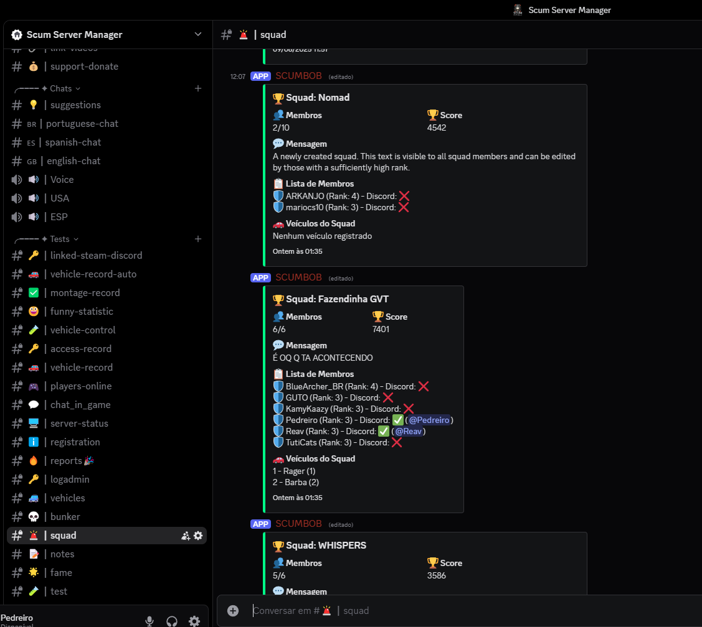

# 🚀 SCUM Server Manager 2.0

**Complete management system for SCUM servers with modern web interface, integrated Discord bot, and advanced vehicle control.**

## 📋 What is SCUM Server Manager 2.0?

SCUM Server Manager 2.0 is a tool specifically developed for SCUM server administrators who need total control over their server. Unlike other tools, this system offers:

### 🎯 **Main Features:**

#### **1. Real-Time Dashboard**
- Online/offline player monitoring
- Server statistics (CPU, RAM, status)
- Top 3 players by fame
- Automatic restart control
- Active bunker status

#### **2. Advanced Player System**
- Complete player management (24+ players)
- Tag system (Beginner, VIP, Admin)
- Whitelist, ban, and mute control
- Login history and playtime
- Administrator permission configuration

#### **3. Fame (Reputation) System**
- Automatic ranking based on fame points
- Top 8 players with detailed scores
- Relative percentage system to leader
- Automatic score updates

#### **4. Integrated Discord Bot**
- **Automatic commands**: `/rg` for vehicle registration
- **Configurable webhooks** for 8 types of notifications:
  - Player Panel
  - Admin Log
  - Bunkers
  - Server Status
  - Vehicles
  - In-Game Chat
  - Fame System
  - Fun Statistics

#### **5. Vehicle Control**
- **Automatic registration system** for vehicles
- **Complete history** of events (disappearance, inactive timer)
- **Ownership control** (with/without owner)
- **Location monitoring** (X, Y, Z coordinates)
- **Report system** via Discord

#### **6. Administration Panel**
- Detailed logs of administrative commands
- Automatic backup system
- Advanced server configurations
- System resource monitoring

#### **7. Server Configuration**
- **General Settings**: Basic configurations
- **World Settings**: NPCs, animals, and environment
- **Vehicle Settings**: Vehicles and fuel
- **Damage Settings**: Damage multipliers
- **Respawn Settings**: Prices and respawn times
- **Special Resources**: Special server resources

## 🖼️ Screenshots

### Main Dashboard


### Player System


### Fame System


### Discord Settings


### Administration


### Vehicle History


### System Settings


### Server Configuration


## 🛠️ Technologies and Architecture

### **Backend (Node.js)**
- **Express.js**: REST API for frontend communication
- **Discord.js**: Discord bot with automatic commands
- **SQLite**: Local database for persistence
- **JWT**: Secure authentication system
- **File System**: Real-time SCUM log monitoring

### **Frontend (React + TypeScript)**
- **React 18**: Modern and responsive interface
- **TypeScript**: Static typing for greater security
- **Tailwind CSS**: Consistent design system
- **Framer Motion**: Smooth animations
- **PWA**: Offline functionality and mobile installation

### **SCUM Integration**
- **Log monitoring**: Automatic reading of SCUM log files
- **Webhooks**: Real-time notifications to Discord
- **Vehicle control**: Registration and monitoring system
- **Fame system**: Integration with game statistics

## 📁 Project Structure

```
ScumServerManager2.0/
├── Backend/                    # Node.js server
│   ├── routes/                # REST APIs
│   │   ├── players.js         # Player management
│   │   ├── vehicles.js        # Vehicle control
│   │   ├── famepoints.js      # Fame system
│   │   ├── discord.js         # Discord integration
│   │   └── server.js          # Server status
│   ├── src/
│   │   ├── bot.js             # Main Discord bot
│   │   ├── vehicle_control.js # Vehicle control system
│   │   ├── data/              # Game data and images
│   │   └── middleware/        # Authentication and validations
│   └── server.js              # Main server
├── Frontend/                   # React interface
│   ├── src/
│   │   ├── components/        # Reusable components
│   │   ├── pages/             # Application pages
│   │   └── services/          # API communication
│   └── public/                # Public assets
└── docs/                      # Documentation and screenshots
```

## 🚀 Installation and Configuration

### **Prerequisites**
- Node.js 18+ installed
- SCUM server configured and running
- Discord bot created (optional, but recommended)

### **1. Backend Configuration**
```bash
cd Backend
npm install
cp env.example .env
```

**Configure the `.env` file:**
```env
# SCUM Server Configuration
SCUM_LOG_PATH=C:\SCUM\SCUM\Saved\Logs\SCUM.log
SCUM_ADMIN_LOG_PATH=C:\SCUM\SCUM\Saved\Logs\AdminLog.txt

# Discord Bot Configuration
DISCORD_TOKEN=your_bot_token
DISCORD_CLIENT_ID=your_client_id

# Web Server Configuration
PORT=3001
JWT_SECRET=your_secret_key
```

### **2. Frontend Configuration**
```bash
cd Frontend
npm install
npm run dev
```

### **3. Discord Bot Configuration**
1. Create a bot in the [Discord Developer Portal](https://discord.com/developers/applications)
2. Configure necessary permissions
3. Add the token to the `.env` file
4. Configure webhooks for each notification type

## ⚙️ Specific Features

### **Vehicle System**
- **Automatic registration**: Vehicles are automatically registered when they appear on the server
- **Ownership control**: System to link vehicles to players
- **Monitoring**: Tracking of location and status
- **Discord commands**: `/rg` for manual vehicle registration

### **Fame System**
- **Automatic scoring**: Based on player actions on the server
- **Dynamic ranking**: Real-time updates
- **Detailed statistics**: Percentage, change history

### **Discord Integration**
- **8 configurable webhooks** for different notification types
- **Automatic commands** for administration
- **Real-time notifications** of important events

## 📚 Detailed Documentation

- **[Complete Configuration](Docs/README.md)**: Step-by-step guide
- **[API Endpoints](Docs/Endpoints/)**: API documentation
- **[Authentication System](Docs/RESUMO_SISTEMA_AUTH.md)**: How security works
- **[Vehicle Control](Docs/RESUMO_VEHICLE_CONTROL.md)**: Detailed vehicle system
- **[Discord Bot](Docs/RESUMO_FINAL_BOT.md)**: Bot configuration

## 🎮 Compatibility

- **SCUM**: Version 1.0.1.3.96391 (tested)
- **Systems**: Windows 10/11
- **Node.js**: 18.x or higher
- **Discord**: Bot API v10

## 🤝 Contributing

1. Fork the project
2. Create a Feature Branch (`git checkout -b feature/NewFeature`)
3. Commit your changes (`git commit -m 'Add new feature'`)
4. Push to the Branch (`git push origin feature/NewFeature`)
5. Open a Pull Request

## 📄 License

This project is under the MIT license. See the [LICENSE](LICENSE) file for more details.

## 👨‍💻 Author

**Paulo Pedreiro**
- GitHub: [@PauloPedreiro](https://github.com/PauloPedreiro)
- Project developed specifically for the SCUM community

## 🙏 Acknowledgments

- SCUM Brazil Community
- Developers of the libraries used
- Project testers and contributors

---

⭐ **If this project helped you manage your SCUM server, consider giving it a star in the repository!**

## 📞 Support

For questions, suggestions, or issues:
- Open an [Issue](https://github.com/PauloPedreiro/Scum-Server-Manager/issues) on GitHub
- Consult the documentation in the `Docs/` folder
